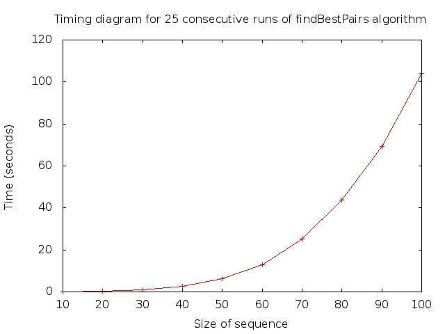

Michael Kosler - CSCE 411

# Homework 5 - RNA Sequences

## Introduction

Given a sequence of RNA molecules, find the fold which produces the most pairs between the top and bottom of the folds.

From a programming perspective, RNA sequences are represented by a string composed of a random assortment of the characters "AUGC". Given this sequence, we must write a dynamic programming algorithm to solve the recursion:

$$OPT(i,j)=\max(OPT(i,j-1),1+\max(OPT(i,t-1)+OPT(t+1,j-1))),\forall t, (t,j) \text{is a valid pair}$$

In order for any given two characters $b_{i}, b_{j}$ to be a valid RNA pair, they must satisfy the following conditions:

1. No sharp turns, i.e. $j-i>4$;
2. "A" must pair with "U", and "G" must pair with "C";
3. Each character can be in at most one pair;
4. Given two pairs $b_{i}, b_{j}$, and $b_{k}, b_{l}$, we cannot have $i<k<j<l$.

## Theoretical Analysis

`findBestPairs`, which is my name for the algorithm to solve the above problem, takes $O(n^{3})$ time to complete, where $n$ is the length of the sequence. I memoize the calls to $OPT(i,j)$, thus significantly reducing the overall running time through the reuse of old results.

## Experimental Setup

### Requirements

- [Lua 5.1](http://www.lua.org/home.html)
- [LuaProfiler](http://luaprofiler.luaforge.net/)
- [LuaRocks](http://luarocks.org/) *to download LuaProfiler, as the links on the website are broken*

### Timing

I used LuaProfiler to generate my timing. Lua itself does not have a heavy-duty timer, so the timing is based on thte total time spent in twenty-five calls to the algorithm, rather than a single call.

### Generating Inputs and Timing

Inputs are generated via a simple Lua script which creates a file "test_n.txt", where $n$ is a command-line argument for the length of the sequence. The file is then filled with 25 sequences of length $n$, each separated by a newline.

I tested against 9 different sequence lengths: 10 - 100, increasing by ten each step. Given my assumption that the runtime is a cubic, I need at least four points to describe the cubic curve.

As a single call to the algorithm does not produce any significant time difference measured by LuaProfiler, my timing is based on the sum of 25 iterations of the algorithm with 25 random sequences of a given sequence length.

Lua is an interpreted language, so the overall execution speed of my tests gets extraordinarily slow past sequences of 100 characters. That is why I stopped at 100.

## Experimental Results

From the plot in Figure 1, the graph seems to be running somewhere between quadratic and cubic for values greater than 50. Since we are using memoization to cache our results, and since the requirements for a valid pair are fairly steep, the algorithm probably quickly rules out many of the worst case scenarios.

